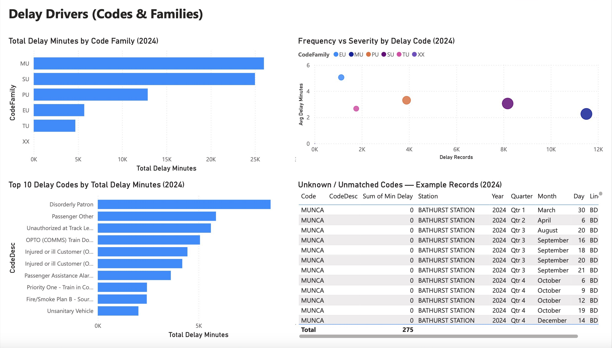
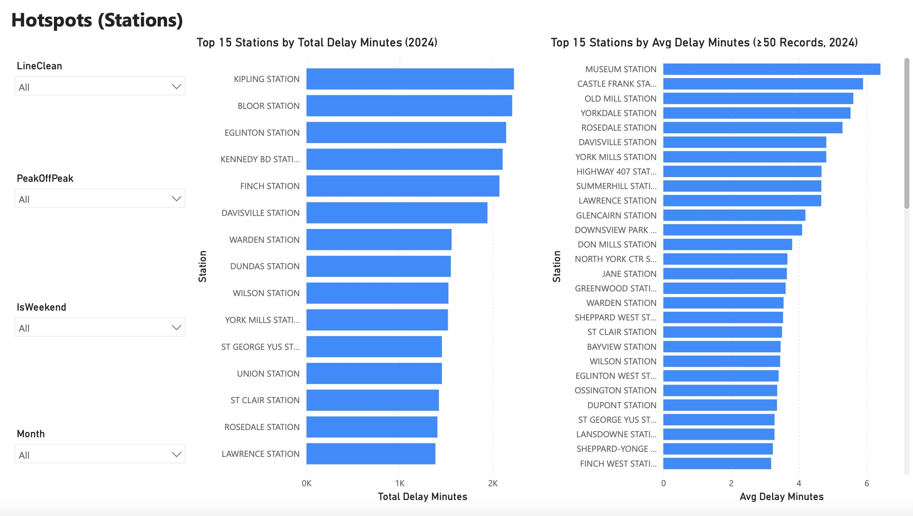

# TTC Subway Delays 2024 — Hotspots & Drivers

This project analyzes TTC subway delay records from 2024 to understand:
- **When** delays occur most often (time patterns)
- **Where** delays concentrate (station hotspots)
- **What** categories/codes drive the most delay minutes (drivers)

## Dashboard (Power BI)
The Power BI report includes three pages:
1. **Overview**: total delay minutes, records, trends over time, hourly patterns, top stations, top codes
2. **Drivers**: delay minutes by code family, top code descriptions, frequency vs severity
3. **Hotspots**: stations ranked by total delay minutes and average delay minutes (with a minimum-records filter)

## Dashboard Preview

### Overview

### Drivers

### Hotspots

Key totals from the report:
- **Total Delay Minutes:** ~74K
- **Delay Records:** ~26K
- **Avg Delay Minutes per record:** 2.81
- **Total Gap Minutes:** ~109K

(Values are rounded as shown in the dashboard export.)

## Key findings (descriptive, not causal)
- Delay records peak in late afternoon/early evening hours.
- A small set of delay codes account for a large share of total delay minutes (e.g., “Disorderly Patron”, “Passenger Other”, “Unauthorized at Track Level”).
- Several major stations consistently rank high in total delay minutes (e.g., Kipling, Bloor, Eglinton).

## Tools
- **Python (pandas)** for cleaning, feature engineering, and exploration
- **SQL (SQLite)** for grouped summaries and “top N” queries
- **Power BI** for interactive dashboarding

## Data prep summary
- Combined date + time into a single DateTime field
- Engineered features: hour, month, weekend flag, peak/off-peak, code family
- Joined delay code descriptions (not all codes matched; unmatched codes were kept and labeled)

## Repro steps (high-level)
1. Load the raw TTC delay data and delay code lookup
2. Clean fields and create time features (Hour, Month, IsWeekend, PeakOffPeak)
3. Merge code descriptions; keep unmatched codes as “Unknown/Unmatched”
4. Export a cleaned CSV for Power BI
5. Build the dashboard pages (Overview / Drivers / Hotspots)

## Files
- `data/ttc_subway_delays_2024_stage3.csv` — cleaned dataset used in Power BI
- `sql/core_queries.sql` — core SQL queries (hourly, station, code drivers)
- `powerbi/dashboard.pdf` — exported dashboard
- `screenshots/` — page screenshots for quick viewing
